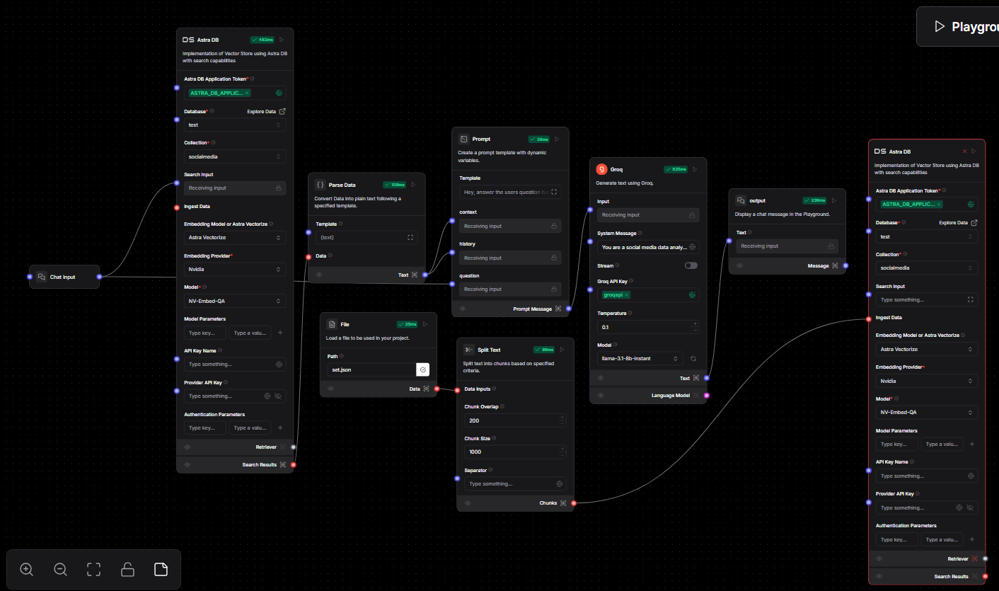
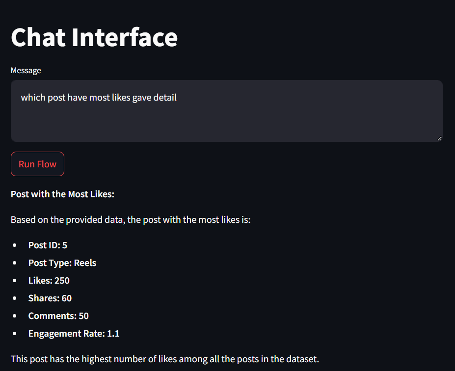

# AI Chatbot for Social Media Data Analysis

This repository contains the code for an AI chatbot that analyzes social media data and provides insightful responses to user queries. The application is built using **Langflow** and **DataStax Astra DB**, and it is hosted on [Streamlit](https://chatbot-q.streamlit.app/).

---

## Table of Contents
1. [Introduction](#introduction)
2. [Features](#features)
3. [Tech Stack](#tech-stack)
4. [Architecture](#architecture)
5. [Setup and Installation](#setup-and-installation)
6. [How It Works](#how-it-works)
7. [Screenshots](#screenshots)
8. [License](#license)

---

## Introduction

This AI chatbot provides insights and analysis of social media engagement data. Users can ask questions about data trends, engagement metrics, and other details related to their social media accounts.

The chatbot uses:
- **Langflow** to design the conversational flow.
- **DataStax Astra DB** for vectorized data storage and retrieval.

---

## Features

- Real-time social media data analysis.
- Dynamic conversational flow using Langflow.
- AI-generated responses based on user queries.
- Data retrieval powered by Astra DB.
- Hosted on Streamlit for easy accessibility.

---

## Tech Stack

- **Langflow**: For building and managing the conversational logic.
- **DataStax Astra DB**: For efficient data storage and vector search.
- **OpenAI GPT Model**: To generate human-like responses.
- **Streamlit**: For hosting the chatbot interface.

---

## Architecture

The chatbot architecture is designed to efficiently handle user queries and provide meaningful insights. Below is an overview of the flow:

1. **Chat Input**: User sends a query to the chatbot.
2. **Data Retrieval**:
    - The query is processed and matched against stored social media data in Astra DB.
    - Vectorized embeddings and similarity searches are performed to find relevant data.
3. **Data Processing**:
    - Retrieved data is parsed and processed into a format suitable for generating responses.
4. **Response Generation**:
    - The GPT model generates responses based on processed data and conversational history.
5. **Output**: Response is displayed to the user.

The visual flow, as built in Langflow, is shown below:



---

## Setup and Installation

Follow these steps to set up the chatbot locally:

1. **Clone the Repository**:
    ```bash
    git clone https://github.com/AryanPrajapati02/chatbot.git
    cd chatbot
    ```

2. **Install Dependencies**:
    ```bash
    pip install -r requirements.txt
    ```

3. **Set Up Environment Variables**:
    Create a `.env` file with the following variables:
    ```env
    ASTRA_DB_APPLICATION_TOKEN=<your_astra_db_token>
    OPENAI_API_KEY=<your_openai_api_key>
    ```

4. **Run the Application**:
    ```bash
    streamlit run app.py
    ```

5. **Access the Chatbot**:
    Open your browser and navigate to `http://localhost:8501`.

---

## How It Works

1. **Input Data**:
   - User enters a query related to social media data.
   - Example: "What is the average engagement rate of posts in December?"

2. **Processing**:
   - The query is passed to Langflow for contextual understanding.
   - Astra DB retrieves relevant data from the "socialmedia" collection.

3. **Response Generation**:
   - The GPT model analyzes the retrieved data and formulates a response.

4. **Output**:
   - The response is displayed in the Streamlit interface.

---

## Screenshots

### Langflow Workflow


*The Langflow interface showing the chatbot’s logic.*

### Streamlit Interface


*User interacting with the chatbot on Streamlit.*

---

## License

This project is licensed under the MIT License. See the [LICENSE](LICENSE) file for more details.

---

## Hosted Link

Try the live chatbot [here](https://chatbot-q.streamlit.app/).

